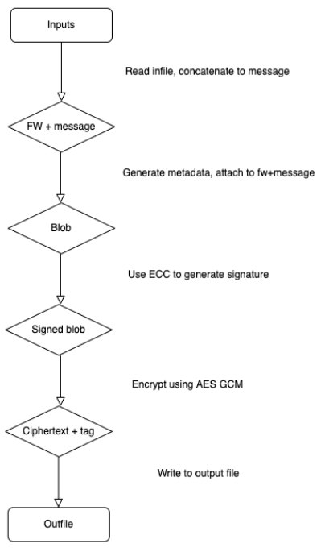

# README

# Our banner :p

```
'  $$\      $$\                                                       $$\     $$\                       $$$$$$\                                                    $$\                                                                         $$\                                             $$\                               $$\ $$\               $$\                      $$\                                                   
'  $$ | $\  $$ |                                                      $$ |    $$ |                      \_$$  _|                                                   $$ |                                                                        $$ |                                            $$ |                              $$ |\__|              \__|                     $$ |                                                  
'  $$ |$$$\ $$ | $$$$$$\         $$$$$$\   $$$$$$\   $$$$$$\        $$$$$$\   $$$$$$$\   $$$$$$\          $$ |$$\    $$\  $$$$$$$\        $$$$$$\  $$$$$$$\   $$$$$$$ |      $$\  $$\  $$\  $$$$$$\         $$$$$$\   $$$$$$\   $$$$$$\        $$$$$$$\   $$$$$$\   $$$$$$\   $$$$$$\        $$$$$$\    $$$$$$\         $$$$$$\  $$ |$$\ $$$$$$\$$$$\  $$\ $$$$$$$\   $$$$$$\ $$$$$$\    $$$$$$\        $$\   $$\  $$$$$$\  $$\   $$\ 
'  $$ $$ $$\$$ |$$  __$$\        \____$$\ $$  __$$\ $$  __$$\       \_$$  _|  $$  __$$\ $$  __$$\         $$ |\$$\  $$  |$$  _____|       \____$$\ $$  __$$\ $$  __$$ |      $$ | $$ | $$ |$$  __$$\        \____$$\ $$  __$$\ $$  __$$\       $$  __$$\ $$  __$$\ $$  __$$\ $$  __$$\       \_$$  _|  $$  __$$\       $$  __$$\ $$ |$$ |$$  _$$  _$$\ $$ |$$  __$$\  \____$$\\_$$  _|  $$  __$$\       $$ |  $$ |$$  __$$\ $$ |  $$ |
'  $$$$  _$$$$ |$$$$$$$$ |       $$$$$$$ |$$ |  \__|$$$$$$$$ |        $$ |    $$ |  $$ |$$$$$$$$ |        $$ | \$$\$$  / \$$$$$$\         $$$$$$$ |$$ |  $$ |$$ /  $$ |      $$ | $$ | $$ |$$$$$$$$ |       $$$$$$$ |$$ |  \__|$$$$$$$$ |      $$ |  $$ |$$$$$$$$ |$$ |  \__|$$$$$$$$ |        $$ |    $$ /  $$ |      $$$$$$$$ |$$ |$$ |$$ / $$ / $$ |$$ |$$ |  $$ | $$$$$$$ | $$ |    $$$$$$$$ |      $$ |  $$ |$$ /  $$ |$$ |  $$ |
'  $$$  / \$$$ |$$   ____|      $$  __$$ |$$ |      $$   ____|        $$ |$$\ $$ |  $$ |$$   ____|        $$ |  \$$$  /   \____$$\       $$  __$$ |$$ |  $$ |$$ |  $$ |      $$ | $$ | $$ |$$   ____|      $$  __$$ |$$ |      $$   ____|      $$ |  $$ |$$   ____|$$ |      $$   ____|        $$ |$$\ $$ |  $$ |      $$   ____|$$ |$$ |$$ | $$ | $$ |$$ |$$ |  $$ |$$  __$$ | $$ |$$\ $$   ____|      $$ |  $$ |$$ |  $$ |$$ |  $$ |
'  $$  /   \$$ |\$$$$$$$\       \$$$$$$$ |$$ |      \$$$$$$$\         \$$$$  |$$ |  $$ |\$$$$$$$\       $$$$$$\  \$  /   $$$$$$$  |      \$$$$$$$ |$$ |  $$ |\$$$$$$$ |      \$$$$$\$$$$  |\$$$$$$$\       \$$$$$$$ |$$ |      \$$$$$$$\       $$ |  $$ |\$$$$$$$\ $$ |      \$$$$$$$\         \$$$$  |\$$$$$$  |      \$$$$$$$\ $$ |$$ |$$ | $$ | $$ |$$ |$$ |  $$ |\$$$$$$$ | \$$$$  |\$$$$$$$\       \$$$$$$$ |\$$$$$$  |\$$$$$$  |
'  \__/     \__| \_______|       \_______|\__|       \_______|         \____/ \__|  \__| \_______|      \______|  \_/    \_______/        \_______|\__|  \__| \_______|       \_____\____/  \_______|       \_______|\__|       \_______|      \__|  \__| \_______|\__|       \_______|         \____/  \______/        \_______|\__|\__|\__| \__| \__|\__|\__|  \__| \_______|  \____/  \_______|       \____$$ | \______/  \______/ 
'                                                                                                                                                                                                                                                                                                                                                                                                       $$\   $$ |                    
'                                                                                                                                                                                                                                                                                                                                                                                                       \$$$$$$  |                    
'                                                                                                                                                                                                                                                                                                                                                                                                        \______/                     


```


Team Arthur Intialization Vector Robinson presents: The Super Secure Embedded Bootloader Firmware Thing<sup>TM</sup>

Frame Size:
```
x represents some number of padding depends on the how large the encoding of firmware is
| 16 Tag | 16 Nonce | 64 ECC key | 2 bytes Version | 2 bytes Firmware Length | x Firmware | x Message | 1 Null | x Padding | 64 Padding |
```

> This was the process of encrypting our firmware to maintain the triad of cybersecurity CIA: Confidentiality, Integrity, and Authorization.



> This was the overview of how we wanted to decrypt and flash a new firmware into memory.


Security process:

### AES GCM
We encrypted our firmware using AES-GCM because we wanted to keep the security of AES-CBC which adding an additional authorization factor which GCM provided. AES GCM is a symmetric cipher that uses mathematical properities to ensure data obscurity through confusion and diffusion.

### ECC
We also wanted to provide an additional layer of security as most teams were implementing the RSA public-private key pairs to ensure authenticity, however, we took this one step further. We applied a new technology called Eliptical Curve Cryptography which has higher security than RSA and implements higher levels of math.

### Vigenere
Our last method to ensure total security, and just make our own lives slightly more difficult, was the Vignere Cipher. The Vigenere Cipher is a symmetric cipher which originally utilizes an alphabet table that scrambles data with a predetermined key. However, because we are using raw bytes instead of letters, we decided to implement it with the xor function because that would randomize it enough.

The entire encryption process in pseudocode looks like this:

```py
Signed_Data = ECC_Encrypt(Metadata + Firmware + Message + Padding)
#We want to sign then encrypt because otherwise hashing is basically worthless

AES_Encrypted_Data = AES_Encrpyt(ECC_Signature + Signed_Data)
#Encrypting the signature so it cannot be tampered with

Vig_Encrypted_Data = Vigenere_Encrypt(AES_Encrypted_Data)
#Encrypting with Vigenere because we're extra

Final_Packet = Tag + Nonce + Vig_Encrypted_Data + Null_Frame
```

The entire decryption process in pseudocode looks like this:

```py
Tag = Received_Decryption[:12]
Nonce = Received_Decryption[12:]
#This is sent first, separate from the rest of the blob, the rest is received in frames of 64

Vig_Decrypted_Data = Vigenere_Decrypt(Received_Blob)
#Decrypt Vigenere

AES_Decrypted_Data = AES_Decrypt(Tag, Nonce, Vig_Decrypted_Data)
#Decrypt AES using Tag and Nonce

ECC_Signature = AES_Decrypted_Data[:64]
Encrypted_Firmware_Blob = AES_Decrypted_Data[64:]
#Extract ECC data

Unencrypted_Firmware_Blob = ECC_Verify_And_Decrypt(ECC_Signat
#Verify our ECC signature

Version = Unencrypted_Firmware_Blob[:2]
Firmware_Size = Unencrypted_Firmware_Blob[2:4]
Firmware = Unencrypted_Firmware_Blob[4:Firmware_Size+4]
Message = Unencrypted_Firmware_Blob[Firmware_Size+4:]
#Unpack the entire Firmware blob
```